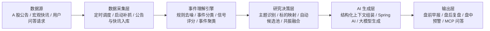

# A 股技术架构图（汇报简化版）

这版适合放在 PPT 或项目汇报里，重点强调项目的 AI 主链路，而不是展开所有实现细节。

## 汇报口径

可以直接这样讲：

“这个项目不是把公告直接交给大模型总结，而是先通过规则引擎完成去噪、分类、评分和聚类，再结合宏观主题识别与个股共振分析，把高价值结构化上下文交给大模型生成盘前、盘后和盘中输出，最后再通过企业微信和 MCP 能力服务人和 Agent。”

## 每层一句话

- 数据源：输入包括 A 股公告、宏观快讯和用户问答请求。
- 数据采集层：通过调度系统高频抓取并统一入库。
- 事件理解引擎：先做规则去噪，再做事件识别、方向判断和评分聚类。
- 研究决策层：把个股事件和宏观主线连接起来，识别真正值得关注的共振机会或风险。
- AI 生成层：基于结构化上下文生成可读性强的投研表达，而不是直接读原始公告。
- 输出层：最终服务盘前早报、盘后复盘、盘中预警以及 Agent 问答。

## 一句话标题建议

如果放在 PPT 页标题，可以直接写：

`A 股事件驱动 AI 投研架构：从公告抓取到共振融合，再到智能输出`
