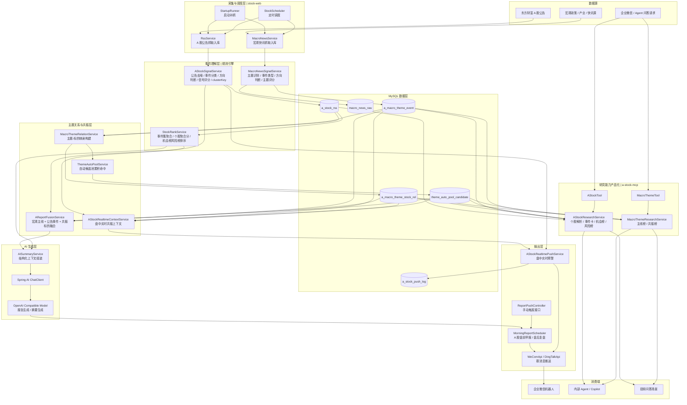

# A 股技术架构图

下面这张图聚焦当前项目的 A 股主链路，覆盖数据源、抓取调度、规则理解、主题共振、LLM 生成、MCP 工具化和消息输出。

## 核心说明

- `stock-web` 是主业务服务，负责抓取、规则理解、榜单计算、盘前盘后报告和盘中推送。
- `AStockSignalService` 是 A 股事件引擎核心，先去噪，再做事件类型、方向和评分判断，并生成事件聚类键。
- `MacroNewsSignalService` 负责把宏观快讯转成“可交易主题”，为后续主线分析和共振识别提供输入。
- `AReportFusionService` 把个股公告、宏观主题、主题映射和共振标的融合成一份高价值上下文，再交给 LLM 生成盘前早报或盘后复盘。
- `AISummaryService` 不是直接把原始公告扔给模型，而是先喂给模型结构化后的上下文，降低噪音和幻觉。
- `a-stock-mcp` 把研究能力封装成 MCP 工具，支持个股解析、事件卡、机会榜、风险榜、主线榜和共振榜，便于 Agent 调用。

## 一句话版本

这个项目的技术架构本质上是一条“金融事件理解流水线”：

`数据抓取 -> 规则去噪与评分 -> 事件聚类 -> 主题映射 -> 共振融合 -> LLM 生成 -> 群推送 / MCP 问答输出`
