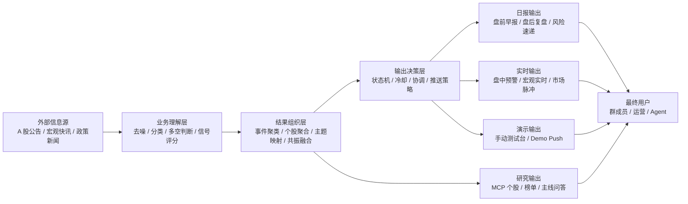
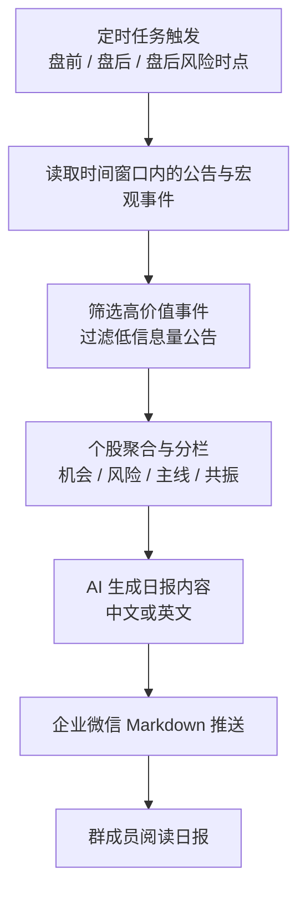
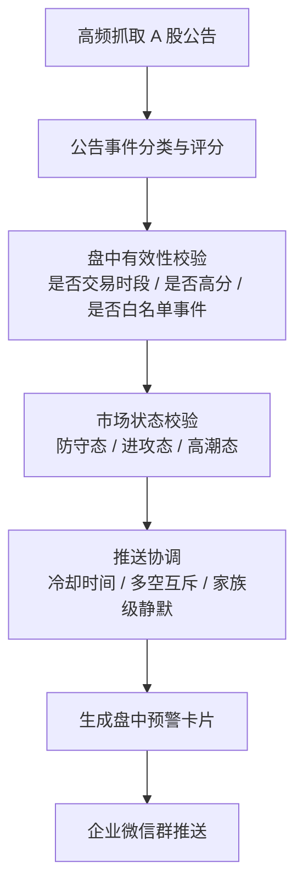
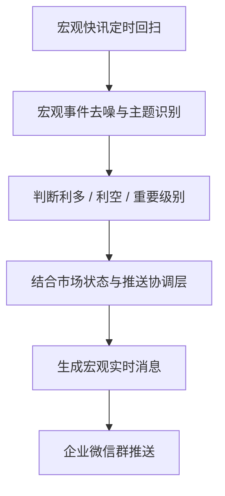
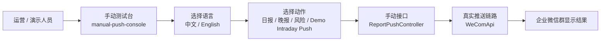
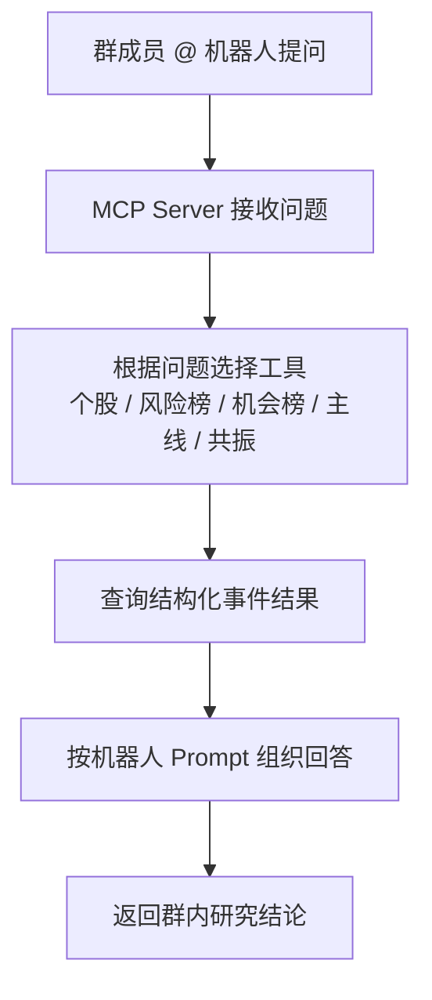
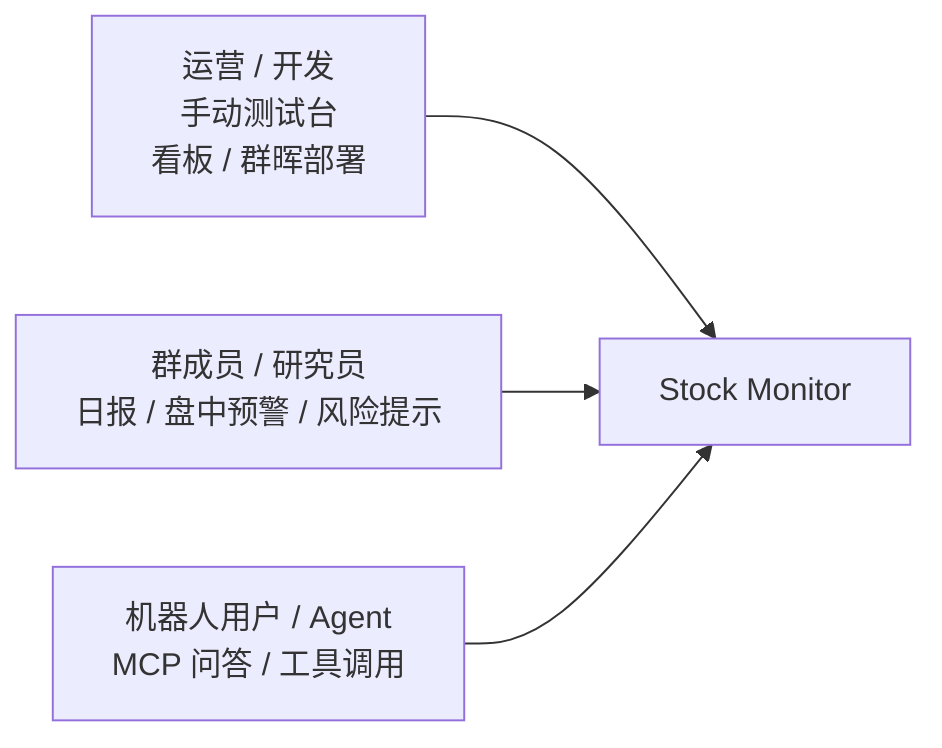

# Stock Monitor 业务流程图

这份文档从“业务运行”和“用户触达”视角描述 `stock_monitor`，重点不是代码模块，而是：

- 数据如何进入系统
- 系统如何筛选、理解和组织事件
- 报告、实时预警、手动演示、MCP 问答分别怎么流转

如果你要对外介绍项目，可以把这份文档理解为“业务版架构图”。

## 1. 业务总览

项目当前主业务围绕 A 股展开，核心目标是把分散的公告和宏观快讯，转化成几类可以直接消费的结果：

- 盘前早报
- 盘后复盘
- 盘后风险速递
- 盘中实时预警
- 宏观实时推送
- 企业微信机器人问答
- 手动演示推送

## 2. 总体业务流程

## 3. 自动化日报业务流程

这条链路负责把过去一段时间内的重要事件整理成固定时点输出。

### 这条流程产出的典型业务结果

- `A股盘前早报`
- `A股盘后复盘`
- `A股盘后风险速递`

## 4. 盘中实时预警业务流程

这条链路强调“高价值、低噪音”，不是所有公告都推，而是只对高分机会或高危风险事件即时吹哨。

### 这条流程的业务价值

- 不是把所有公告刷到群里
- 而是把“值得盘中盯一眼”的事件变成结构化卡片
- 让群成员能快速看到结论、推演、主线共振和风险提醒

## 5. 宏观实时推送业务流程

这条链路关注的是政策、流动性、产业和风险冲击，不依赖单只股票公告。

### 典型业务场景

- 政策发布
- 流动性宽松 / 收紧
- 监管边际变化
- 地缘或商品价格冲击

## 6. 手动演示业务流程

这条链路专门用于测试和对外演示，不依赖定时任务，也不强依赖真实盘中数据。

### 这条流程有两个业务特点

- 可以立即验证功能，不必等待定时任务
- 可以用 mock 数据走真实企业微信发送路径，适合现场展示项目效果

## 7. 企业微信机器人问答业务流程

这条链路不是“推送”，而是“查询式使用”。

### 适合回答的问题

- 某只股票最近偏多还是偏空
- 今天有哪些高分机会股
- 哪条宏观主线最强
- 哪些股票和主线有共振

## 8. 业务角色视图

从业务角色看，这个系统同时服务 3 类人。

### 对不同角色的价值

- 对运营：方便测试、演示、排查和发版验证
- 对群成员：更快获得可执行的信息摘要和风险提醒
- 对 Agent：把研究能力标准化成可调用工具，而不是只能看群消息

## 9. 推荐讲解顺序

如果你要拿这份流程图给别人介绍项目，建议按这个顺序说：

1. 先讲“总体业务流程”，让对方知道系统在做什么
2. 再讲“自动化日报流程”和“盘中实时预警流程”，突出主价值
3. 接着讲“手动演示流程”，说明为什么这个项目便于展示
4. 最后讲“MCP 问答流程”，说明它不只是推送系统，还是一个研究能力平台
