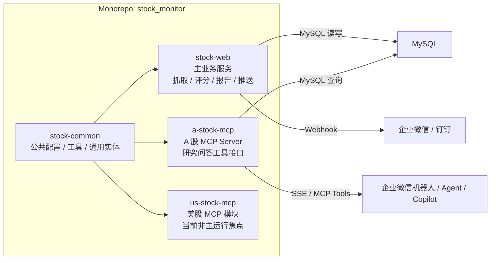
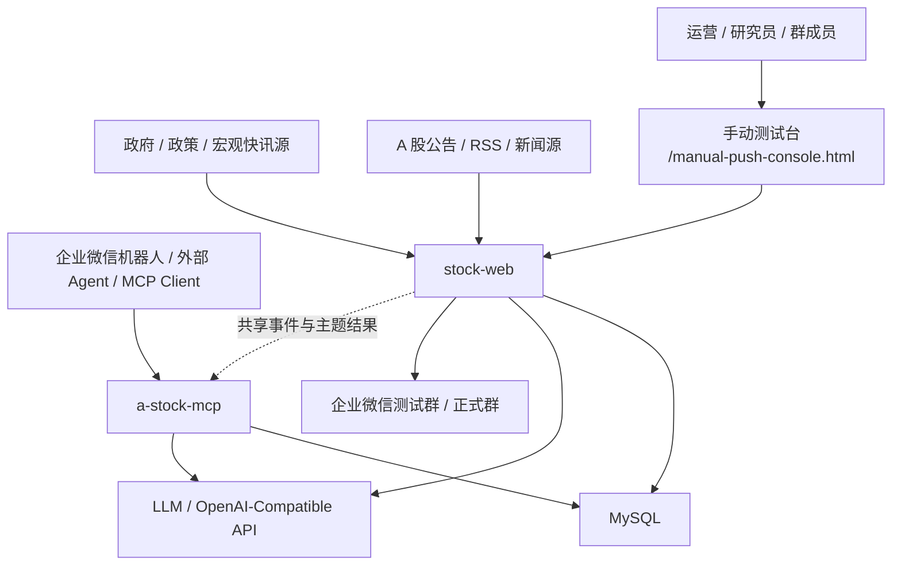
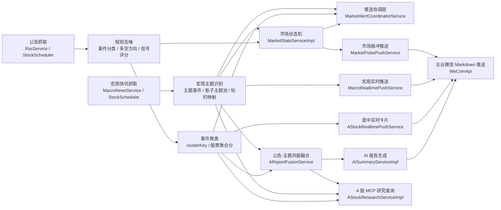
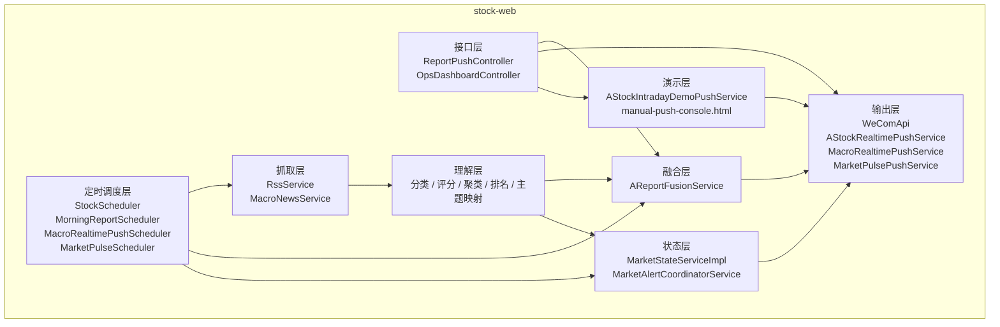
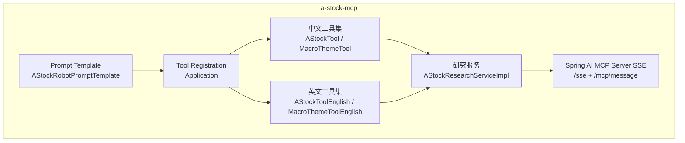
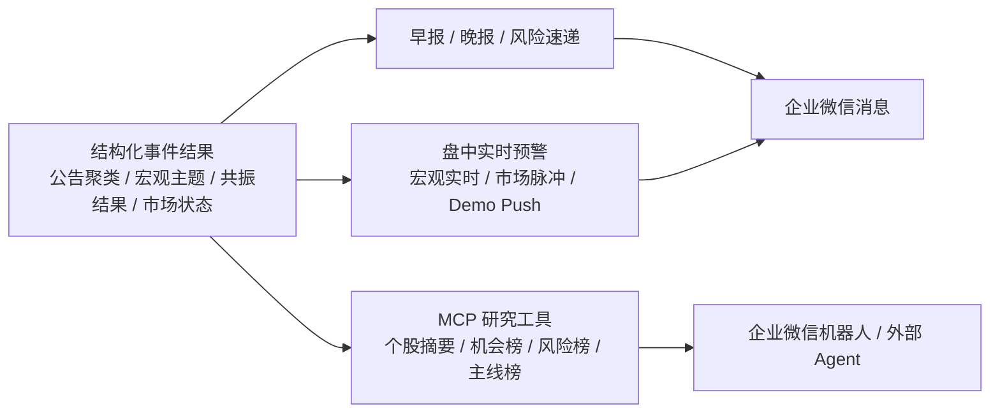
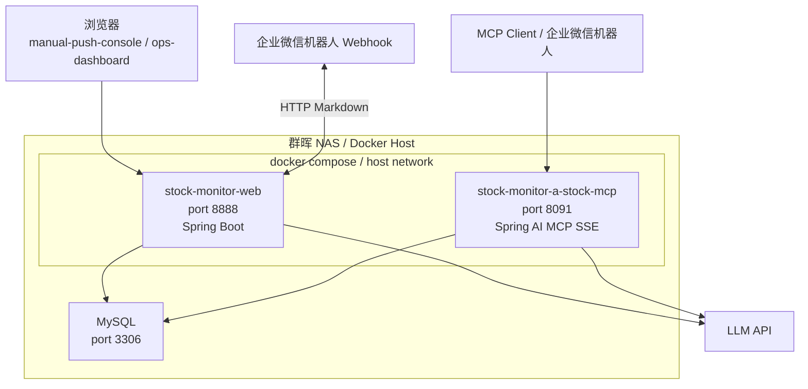

# Stock Monitor 技术架构图

本文面向项目维护者、协作者和对外演示场景，给出 `stock_monitor` 的技术架构全景。图中重点覆盖：

- 多模块代码结构
- A 股事件驱动主链路
- 企业微信推送与 MCP 查询双出口
- 群晖 NAS 上的部署拓扑

## 1. 架构概览

`stock_monitor` 是一个以 A 股为主的事件驱动投研系统。系统从公告、宏观快讯等外部源抓取数据，经过规则去噪、事件分类、信号评分、主题映射和共振融合后，分别输出：

- 盘前早报、盘后复盘、盘后风险速递
- 盘中实时预警、宏观实时推送、市场脉冲推送
- 面向企业微信机器人的 A 股 MCP 研究工具

## 2. 模块视图

## 3. 系统上下文图

## 4. 核心处理链路

下面是项目最核心的 A 股事件驱动处理主链路。

## 5. 运行时组件图

### 5.1 `stock-web` 内部职责

### 5.2 `a-stock-mcp` 内部职责

## 6. 推送与查询双出口

项目的一个关键设计点，是“同一套结构化研究结果，同时服务推送和问答”。

## 7. 部署拓扑图

当前线上部署在群晖 NAS，`stock-web` 与 `a-stock-mcp` 分别以独立容器运行，均使用 host 网络。

## 8. 关键设计说明

### 8.1 为什么拆成 `stock-web` + `a-stock-mcp`

- `stock-web` 负责事件驱动主业务和消息分发，偏“生产工作流”
- `a-stock-mcp` 负责把研究能力标准化成工具接口，偏“对外能力输出”
- 两者共享 MySQL 中间结果，避免重复抓取和重复理解

### 8.2 为什么是“规则先行，LLM 后置”

- 原始公告和快讯噪声很大，直接交给模型容易产生幻觉和不稳定判断
- 先经过规则分类、事件评分、聚类、主题映射之后，LLM 只负责高质量表达与解释
- 这样既降低成本，也显著提升报告和问答的一致性

### 8.3 为什么需要市场状态机与协调层

- 解决短时间内多空信号来回切换
- 解决宏观实时推送、市场脉冲推送之间互相打架
- 通过冷却时间、家族互斥和确认窗口，减少告警风暴

### 8.4 为什么保留手动测试台

- 可绕过定时任务等待，直接验证盘前、盘后、盘中推送链路
- 支持中英文切换，适合产品演示和对外展示
- 新增的 intraday demo push 可以用 mock 数据走真实 WeCom 发送路径

## 9. 建议展示顺序

如果要在汇报或演示中使用，推荐按这个顺序讲：

1. 先讲“模块视图”，说明仓库为什么拆成多模块
2. 再讲“核心处理链路”，说明系统如何把公告变成研究结果
3. 然后讲“推送与查询双出口”，体现产品化能力
4. 最后讲“部署拓扑图”，说明如何在线上运行和扩展
